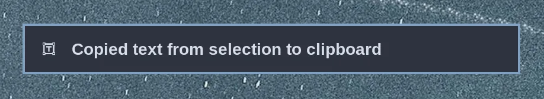

# Text Extraction & Dictation

### Text Extraction

Hit `Super + Ctrl + PrtScr` to select a region on the screen for text extraction. The tesseract open source OCR model will then quickly convert that selection into text and place it on the clipboard. Then you just hit `Super + V` to paste.

This is very helpful for grabbing addresses out of image footers or phone numbers embedded in website headlines.

 

### Dictation

OmixOS ships the VoxType 0.7.4 workflow in the declarative user environment.
It includes the bundled offline Whisper `base.en` model and the GTK4 OSD; no
network model download or Arch package transaction is required. The supported
lifecycle is `omarchy-voxtype-install` and `omarchy-voxtype-remove`, which
start/stop the user service and update the disabled toggle.

Hold `F9` for push-to-talk (press and release), or toggle with `Super + Ctrl + X`.
The dictated text appears in the focused input. The daemon, bundled model,
OSD, status, bindings, and remove/reinstall lifecycle passed graphical
acceptance; real microphone transcription and physical audio acceptance are
still pending.
