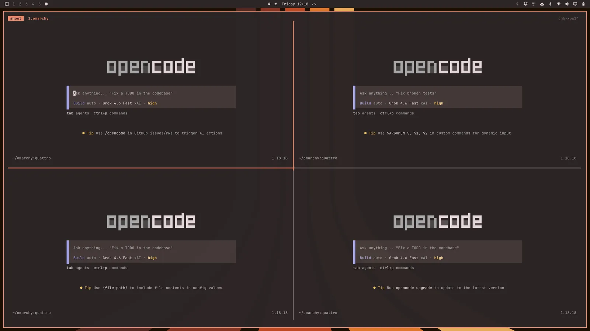

# Terminal

[Ghostty](https://ghostty.org/) is the intended default terminal for the current
OmixOS profile. Foot remains in the runtime for compatibility and lightweight
ARM sessions, but the default terminal preference is seeded to Ghostty. This
default and its Hyprland window are verified through `xdg-terminal-exec` in
the generic ARM graphical test.

If you use Tmux, you may not mind, but if not, Ghostty and Foot are the
supported packaged choices. Do not use the upstream _Install > Terminal_ menu
as a package installer: terminal choices are declarative NixOS/profile state.

You start a new terminal using `Super + Return`. The binding follows the
declarative XDG terminal preference; change it through a profile/user override,
not the upstream package-install menu.

## Tmux

Tmux provides a consistent, programmable interface for panes, windows (aka tabs), and resumable sessions regardless of your terminal. It even works on remote hosts, so when you're SSH'ing into a server, you can use the same approach.

You start a new Tmux session in a fresh terminal using `Super + Alt + Return`, and because Tmux is a persistent process, you can resume your session even if you close that terminal. Just hit `Ctrl + Space` (called the prefix key) then `s` to see all your active sessions.

Omarchy ships with an ergonomically-optimized Tmux configuration, which has a lot of keybindings to learn, so keep [the cheatsheet handy](07-hotkeys.md#tmux).

## Tmux layout functions

Because Tmux is programmable, we can use functions to create layouts. Omarchy ships with four different functions for common developer layouts.

`tdl [agent]` starts a three-way split IDE-like interface with the `$EDITOR` on the left, your chosen AI agent on the right (like `c` for opencode or `cx` for Claude or `codex` for OpenAI), and then a terminal at the bottom.

So `tdl c` would start this (or just `ic`):

 

You can also start a second agent with `tdl c cx` (opencode + claude) (or just `icx`):

 

There's also `tds`, which starts a four-way square with the editor top left, a live diff watcher top right, a terminal bottom left, and opencode bottom right.

You can also start this layout configuration for every subdirectory in the current directory using `tdlm [agent]`, then navigate using `alt + 1/2/3/4/5/...`:

 

Finally, you can start a swarm of agents using `tsl [panes] [command]`. So `tsl 4 c` will give you a four-way grid of opencode agents:

 
