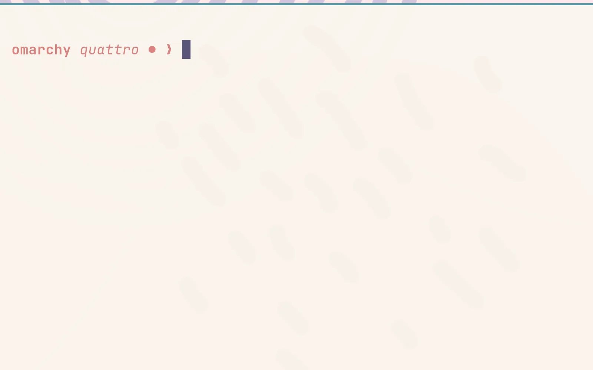

# Prompt

The prompt configuration is user state. Starship is not currently a declared
OmixOS core package, so treat this chapter as a customization example and add
it through a NixOS/Home Manager profile before relying on it.

The upstream Quattro guide uses a minimal [Starship](https://starship.rs/)
prompt. Starship is not declared in the OmixOS ARM core profile; add it through
NixOS/Home Manager or the pinned user-profile search before relying on it.

 

If you want more information or style, you can change the [Starship.rs](https://starship.rs/) configuration in `~/.config/starship.toml`. There's a lot you can do. Just don't go overboard (or do go overboard, do whatever you want, it's your computer!)
